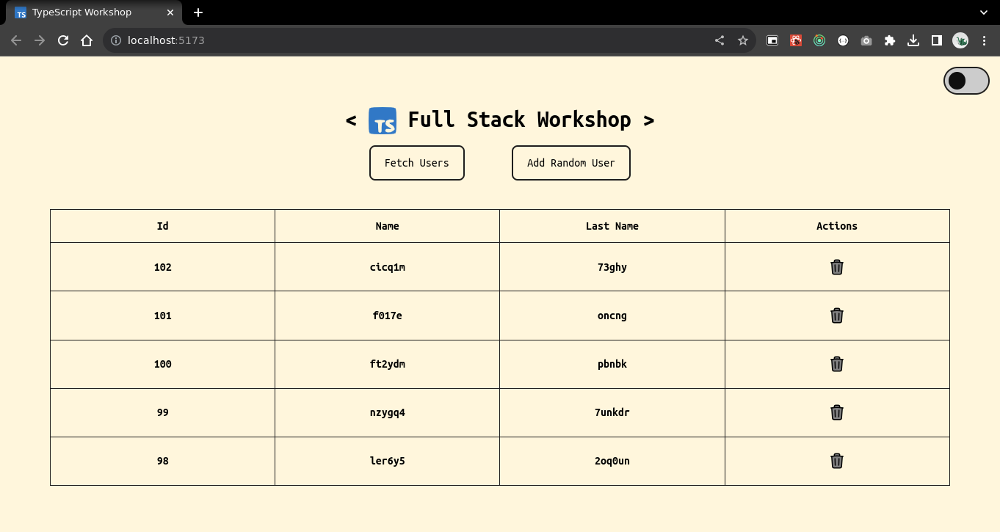
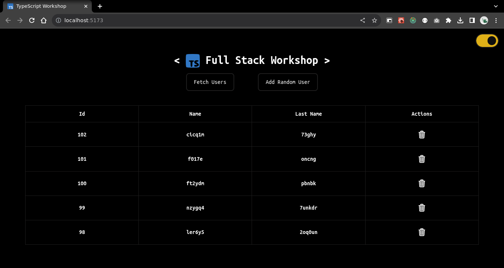

# TypeScript Client

This is the frontend client for our project!

## Technologies used

%20-%2320232a.svg?style=for-the-badge&logo=react&logoColor=%2361DAFB)

## Additional Dependencies

## Next Steps

- Dark mode
- Testing
- Routing

## Features

- [X] Create a new (random) user
- [X] Fetch all users from the database
- [X] Delete a user
- [ ] Fetch mock data from an external API and save it to the database
- [ ] Edit an existing user
- [ ] Create a new user from a form
- [ ] Reset the database
- [ ] Delete all users
- [ ] Create new random user with mock data from an external API
- [ ] Filters!

## Preview (v1.0.0)

### Light Mode

### Dark Mode

