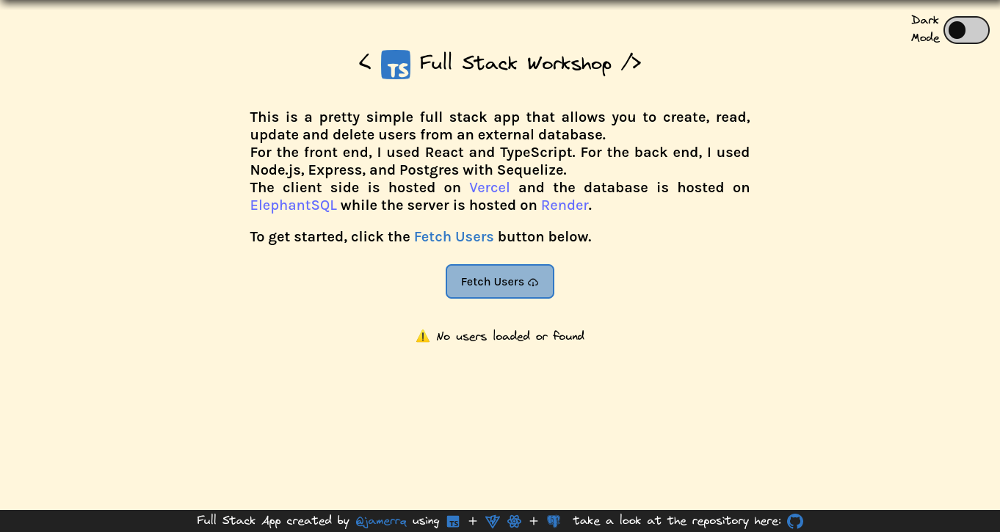
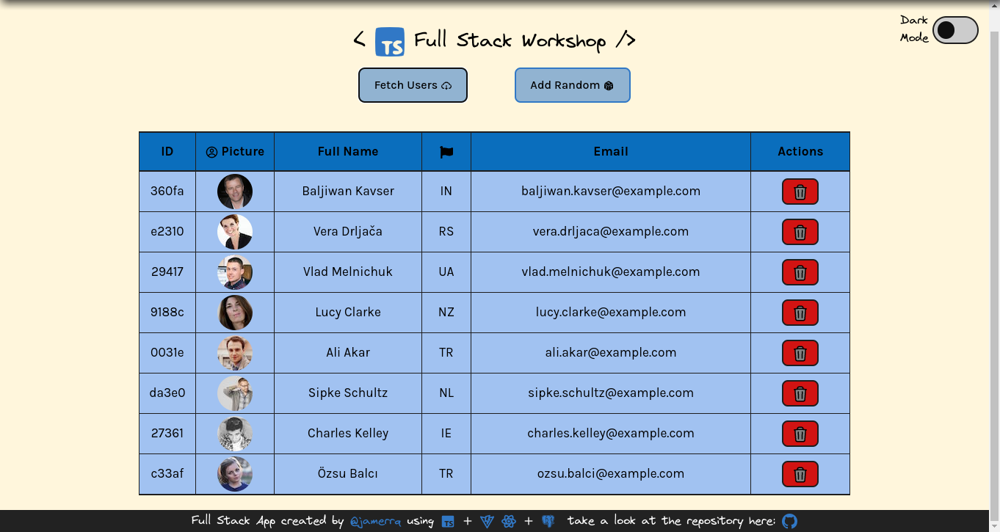
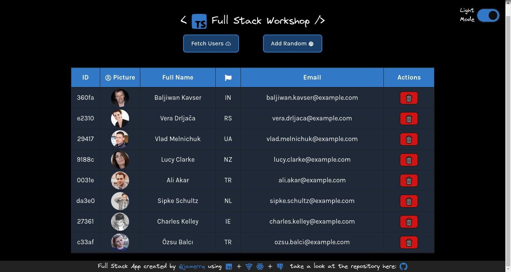

# TypeScript Workshop

Welcome! This is a pretty simple and personal project that I'm using to learn
TypeScript. I'm also using it to try out some new technologies, like Vite and
Tailwind CSS. I'm also using it to try out some new workflows, like using
pnpm instead of npm or yarn. I'm also using it to try out and improve my
software engineering skills, like writing tests, using git, and using
eslint among others.

Feel free to look around and use this as a reference for your own projects. I
hope you find it useful!

PD: This workshop is based on the [TypeScript Henry
Workshop](https://github.com/soyHenry/wks-typescript) which I completed as a
student of the [Henry Bootcamp](https://www.soyhenry.com/). I'm using it as a
base to keep learning and improving my skills.

## Preview

### v2.0.0 (current)

### v2.0.0 Light Mode

### v2.0.0 Dark Mode

## Frontend

%20-%2320232a.svg?style=for-the-badge&logo=react&logoColor=%2361DAFB)

Now deployed on Vercel! Check it out [here](https://wks-typescript.vercel.app/).

## Backend

Now deployed on Render! Check it out
[here](https://wks-typescript-server.onrender.com/api/users).

## Overall Project Technologies

